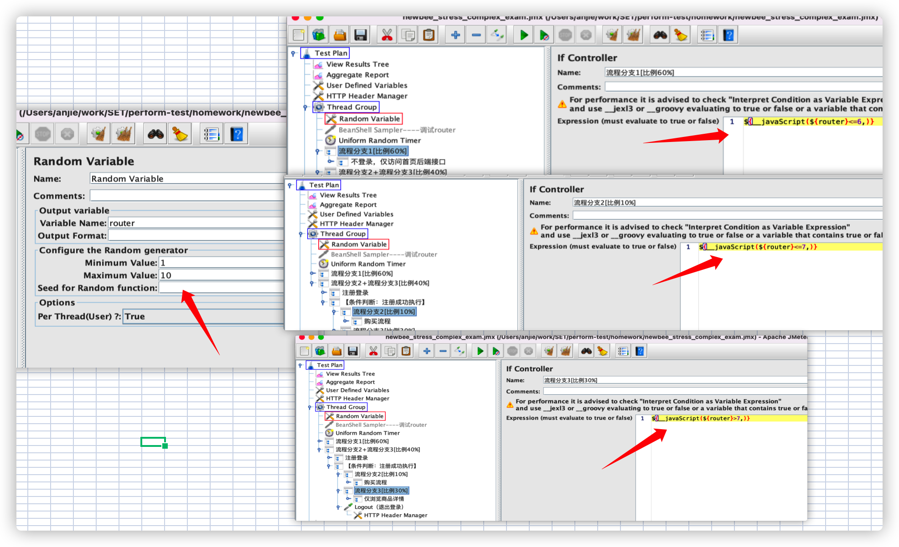
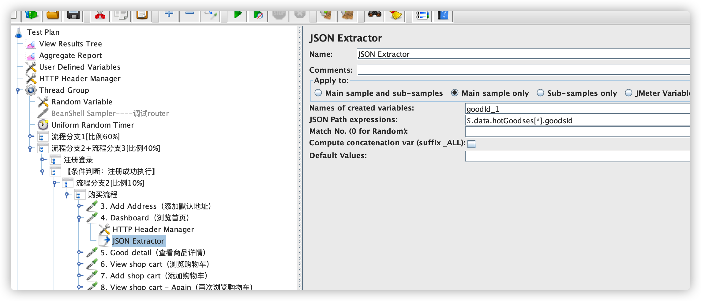
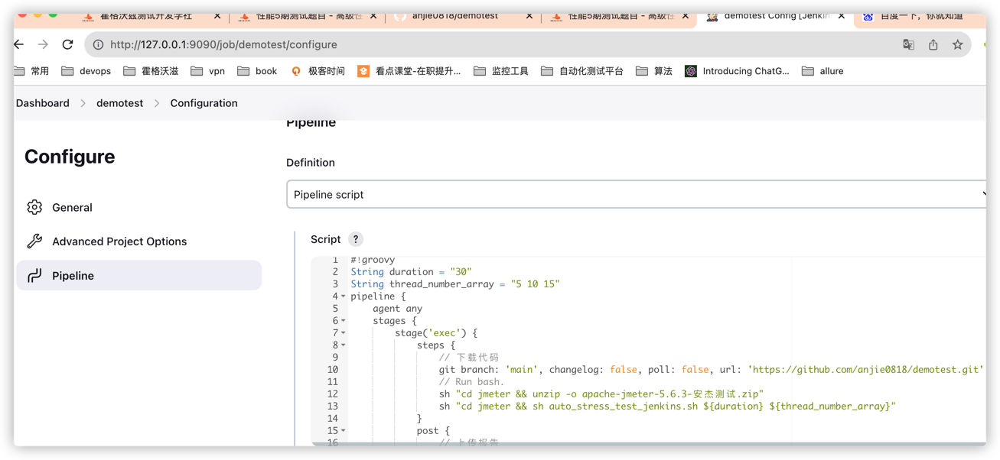
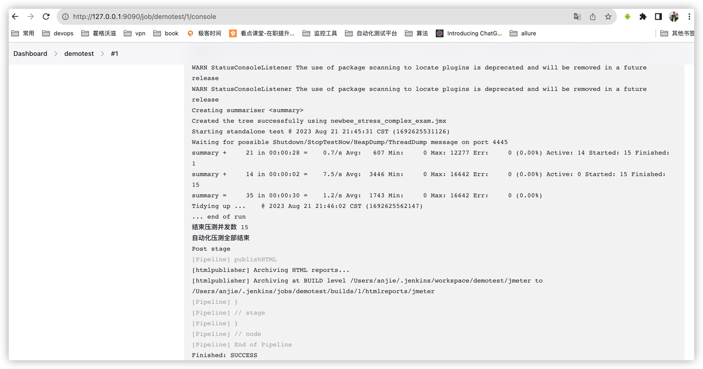
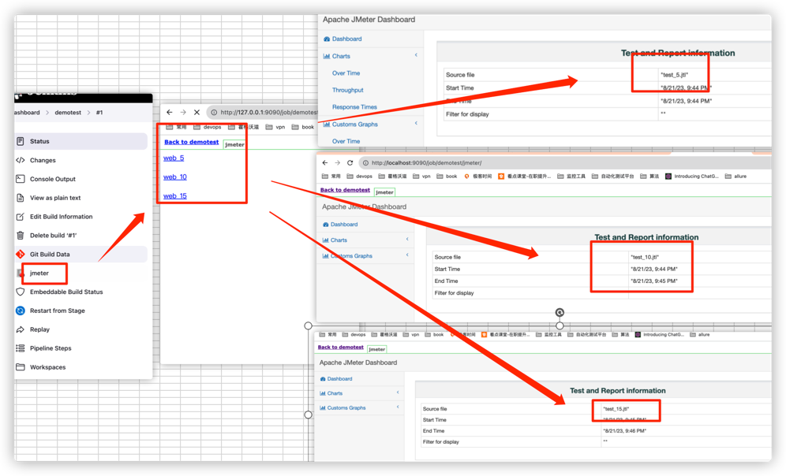
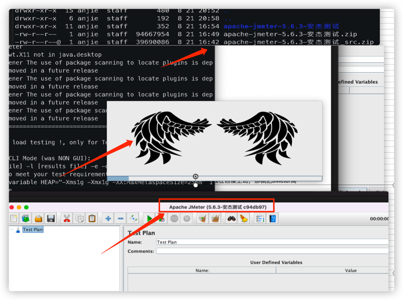

## 题目：
https://ceshiren.com/t/topic/26539
## 作业：
### 一. JMeter压测脚本开发实战训练
[jmx跳转](./jmeter/newbee_stress_complex_exam.jmx)
#### 1、流程分支 1,2,3 的流量控制比例为 6:1:3
* 方法：Random Variable + if Controller

#### 2、注册用户的手机号要随机生成，不要重复
* 方法：源码中编写PhoneNumber.java；gradlew distZip打包；jmx中引用函数${__phoneNumber()}
```java
package org.apache.jmeter.functions;
import com.google.auto.service.AutoService;
import org.apache.jmeter.util.JMeterUtils;
import java.util.Random;
/**
 * PhoneNumber
 */
@AutoService(Function.class)
public class PhoneNumber extends AbstractHostIPName {

    private static final String KEY = "__phoneNumber"; //$NON-NLS-1$

    public PhoneNumber() {
    }

    @Override
    protected String compute() {
        return UniquePhoneNumberGenerator.generateUniquePhoneNumber();
    }
    /** {@inheritDoc} */
    @Override
    public String getReferenceKey() {
        return KEY;
    }
}
class UniquePhoneNumberGenerator {
    public static Random random = new Random();
    public static String generateUniquePhoneNumber() {
        // 中国手机号规则：第一位是1，第二位是3-9中的一个数字，后面跟随9位数字
        StringBuilder phoneNumberBuilder = new StringBuilder("1");
        phoneNumberBuilder.append(random.nextInt(7) + 3); // 随机生成3-9之间的数字
        for (int i = 0; i < 9; i++) {
            phoneNumberBuilder.append(random.nextInt(10));
        }
        return phoneNumberBuilder.toString();
    }
}

```
#### 3、浏览的商品需要随机选取
* 方法：使用jmeter的JSON Extractor
  * $.data.hotGoodses[*].goodsId
  
### 二：自动化压测练习(运行Jenins任务执行压力测试)
* 编写shell实现静默压测 [跳转](./jmeter/auto_stress_test_jenkins.sh)
  ```shell
  # 第一个参数 300 代表运行时间
  # 剩余参数 10 20 30 代表递增线程
  cd jmeter && sh auto_stress_test_jenkins.sh 300 10 20 30
  ```   
* 编写jenkinsfile实现
  * 通过Jenkins参数控制压测并发数、运行时间
  * 在Jenkins中直接输出压测报告
```groovy
#!groovy
String duration = "300"
String thread_number_array = "10 20 30"
pipeline {
    agent any
    stages {
        stage('exec') {
            steps {
                // 下载代码
                git branch: 'main', changelog: false, poll: false, url: 'https://github.com/anjie0818/demotest.git'
                // Run bash.
                sh "cd jmeter && unzip -o apache-jmeter-5.6.3-安杰测试.zip"
                sh "cd jmeter && sh auto_stress_test_jenkins.sh ${duration} ${thread_number_array}"
            }
            post {
                // 上传报告
                success {
                    publishHTML([allowMissing: false, alwaysLinkToLastBuild: false, keepAll: true, reportDir: 'jmeter', reportFiles: 'index.html', reportName: 'jmeter', reportTitles: 'jmeter', useWrapperFileDirectly: true])
                }
            }
        }
    }
}
```



### 三：性能监控练习
>电脑太拉了，环境还没搭起来就卡死了
### 四：JMeter 源码修改练习
* 安装包  [跳转](./jmeter/apache-jmeter-5.6.3-安杰测试.zip)


